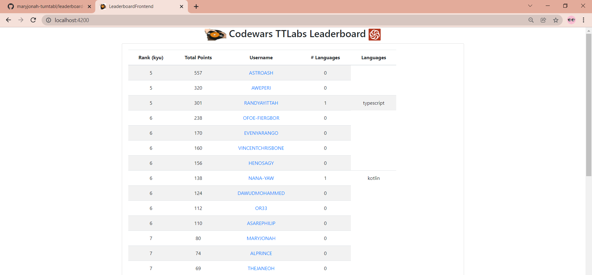

# mary-leaderboard-frontend
Repository of Angular frontend for Ana's leaderboard-service

### Installation process:
1. Clone this repository  
``git clone https://github.com/maryjonah-turntabl/mary-leaderboard-frontend.git``  

2. Next directory to **leaderboard-frontend** directory.  
``cd mary-leaderboard-frontend/leaderboard-frontend``  

3. Also clone the backend spring boot application  
``git clone https://github.com/maryjonah-turntabl/leaderboard-service``  

4. Open the backend application and run the main file **LeaderboardServiceApplication.java**"  

5. Next open the downloaded angular application in your editor (VSCode preferred)  

6. Open a terminal and start the application with the command  
``ng start``

7. Open a browser and access the application on  
**localhost:4200**

Below is an image of what the application looks like

